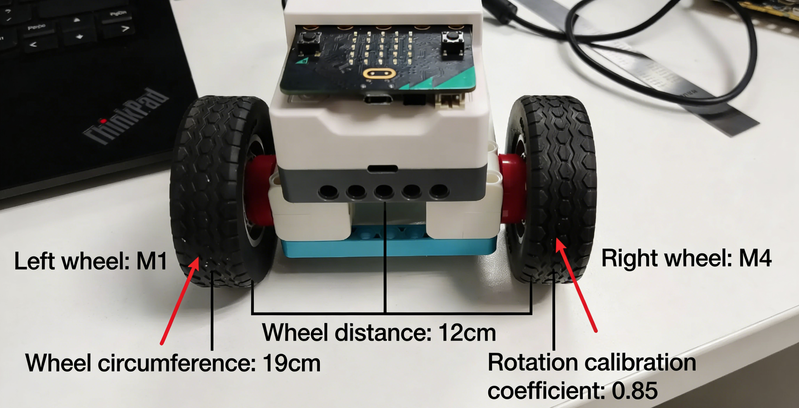

# comboRotate Rotation Function Usage Example

This document provides basic usage examples for the `comboRotate` function.



## Basic Usage Example

```typescript
input.onButtonPressed(Button.A, function () {
    nezhaV2.comboRotate(90, 20)
})
nezhaV2.setWheelPerimeter(19, nezhaV2.Uint.cm)
nezhaV2.setComboMotor(nezhaV2.MotorPostion.M1, nezhaV2.MotorPostion.M4)
nezhaV2.setWheelBase(12, nezhaV2.Uint.cm)
nezhaV2.setComboRotateCalibration(0.85)
```

**Description:**
- When button A is pressed, the robot rotates 90 degrees clockwise at 20% speed
- Must set wheel perimeter, motor positions, wheelbase, and calibration factor first
